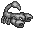
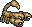
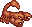
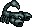


#  Image dyeing system

The image dyeing system is a very clever automatic image recoloring system, permitting to reuse the same image for different versions.
The main use of it is to recolor gray-scaled version of monster sprites images, to easily create many different ones with a single sprite file.

An example:
<table class="table table-bordered table-hover" markdown="1">
    <thead>
        <tr>
            <th>Original image</th>
            <th colspan="3">Dyed images</th>
        </tr>
    </thead>
    <tbody>
        <tr>
            <td></td>
            <td></td>
            <td></td>
            <td></td>
        </tr>
        <tr>
        </tr>
    </tbody>
</table>

### Simple colors and palettes

A pixel has a simple color if it is not black and if its **non-zero RGB components** are all equal (components equal to 0 aren't concerned). Or described in terms of the HSV color model: it has a hue divisible by 60, full saturation, and any volume other than zero.

There are seven simple colors: (Followed by example in hexadecimal values.)

 * **R**ed: FF0000, AA0000.
 * **G**reen: 00FF00, 00AB00.
 * **B**lue: 0000FF, 000081.
 * **C**yan: 00FFFF, 00AAAA.
 * **M**agenta: FF00FF, c200c2.
 * **Y**ellow: F0F000, 747400.
 * **W**hite (gray, in fact): FFFFFF, 989898.

For a given color, there are 255 different intensities (from 1 to 255, or from 01 to FF in hexadecimal). For RGB, the non-zero value is the intensity. For HSV, the volume is the intensity, scaled to 255.

A palette is a sequence of RGB colors, for example `#8c4b41,da9041,ffff41`. An intensity of 255 becomes color `#ffff41`. An intensity of 0 is left unchanged (as black, `#000000`). Intensities with no explicit color are linearly interpolated between the two closest value. Black is implicitly the first color of the palette. For example:

<table class="table table-bordered table-hover" markdown="1">
    <thead>
        <tr>
            <th>Intensity</th>
            <th>Color</th>
        </tr>
    </thead>
    <tbody>
        <tr>
            <td>50</td>
            <td>#522C26</td>
        </tr>
        <tr>
            <td>85</td>
            <td>#8c4b41</td>
        </tr>
        <tr>
            <td>100</td>
            <td>#995741</td>
        </tr>
        <tr>
            <td>170</td>
            <td>#da9041</td>
        </tr>
    </tbody>
</table>

Palettes can have from one to 255 colors.

Pixels with complicated colors or without any dedicated palette are left unchanged by the dye process. The system can dye up to 1785 different colors.

### Specifying palettes

Whenever an image (usually a PNG file) is specified in an XML file, a palette can be appended to its name. The image is then automatically dyed on loading. For example, if one changes an image resource from `foo.png` to `foo.png|W:#ffff00`, then all the gray pixels of `foo.png` will be replaced by shades of yellow, as described above.

Several palettes (one per simple color) can be appended to an image. For example, green and red pixels are recolored independently for image `foo.png|G:*palette1*;R:*palette2*`.

Palettes can either be specified as the name of a file containing a palette (format not yet defined) or directly defined as a color sequence. A **#** symbol (often called **pound**, **hash**, or **sharp**) is prefixed to a color sequence, so that the system understands that this is a color, not another file.

### Dyeing sprites

When indicating the dyeable colors in an image, some palettes can be left unspecified. For example, the resource name `foo.png|G;R:*palette1*;Y` means that green, red, and yellow, pixels of the image have to be dyed. But no palettes are specified for green and yellow pixels.

These palettes will be specified at a higher level. If the `foo.png` file is part of a sprite description named `bar.xml`. Then palette specifications can be appended to the file name, e.g. `bar.xml|*palette2*;*palette3*`. These additional palettes are then propagated to any image loaded by `bar.xml` with unspecified palettes. So the `foo.png` is finally recolored with the dye `G:*palette2*;R:*palette1*;Y:*palette3*`.

#### One-channel example
Here is a simple example taken from actual game data. The `data/monsters.xml` file contains the descriptions of all the monsters. For black scorpions, the definition begins with:


  ...
  <monster id="1009" name="Black scorpion">
    ...
    <sprite>monster-scorpion.xml|#0d1313,435a5a,879999,ffffff</sprite>
    ...
  </monster>
  ...


The `data/graphics/sprite/monster-scorpion.xml` then describes the animation of any scorpion, whatever its color. It contains this line:


...
<imageset name="base" src="graphics/sprites/monster-scorpion.png|W" width="48" height="45" />
...


The `monster-scorpion.png` file is a grayscale image, hence the **W** color specifier, so that all its pixels are blackened (or dyed to brown or red for other species of scorpions). If it contained some non-gray pixels, these would not be recolored by the palette specified in the `monsters.xml` file.

Here is another example very well illustrated by Pateame:

{{:pateame-single-channel-dyable-sample.png|Single channel example from Pateame.}}

#### Multi-channel example
Here an example for multi-channel dyeing of an equipment sprite. This example recolors the gray sections of the image to green and the red sections to a gray-blue.


...
<imageset name="base" src="graphics/sprites/head-devcap.png|W;R" width="28" height="19" />
...



...
<sprite>head-devcap.xml|#22ff22,ffffff;#9999ff</sprite>
...


Here is another example very well illustrated by Pateame:

{{:pateame-double-channel-dyable.png|Single channel example from Pateame.}}
### Implementation notes

Palettes have to be specified as part of the image and sprite resource names, so that they can be properly cached. If they were not, there would be collisions: All the recolored sprites would have the same color, the first one to be put in the cache for a given sprite definition. Since they are part of the resource names, they may as well be part of the filenames written in XML files.

### Ideas

