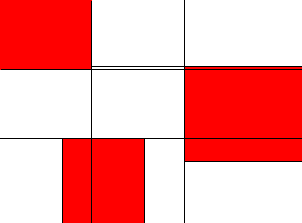


The [last article](partitioning_the_pixel_plane_into_rectangles_which_are_blocked_or_unblocked.html) explained how to partition a static map. But when we want mobile objects to block each other the block map has to be adjusted accordingly. This is in fact not as hard as it seems.

When a dynamic block enters a partition or moves around while touching it, this partition has to be further repartitioned. The original partitioning is of course kept in memory so that it can be used as a basis for the new partitioning when the blocks inside of it move.

The result is that there will be two partitionings of the map in memory. One only with static blocks and another, more complex one based on the first, which takes dynamic blocks into account. The latter one is the one used for route finding. Note that the dynamic block map is less optimal than it would be when it would be calculated from scratch, but I suspect that this trade-off will be beneficial in the end, especially when the number of objects on a map is rather small compared to the number of partitions.
